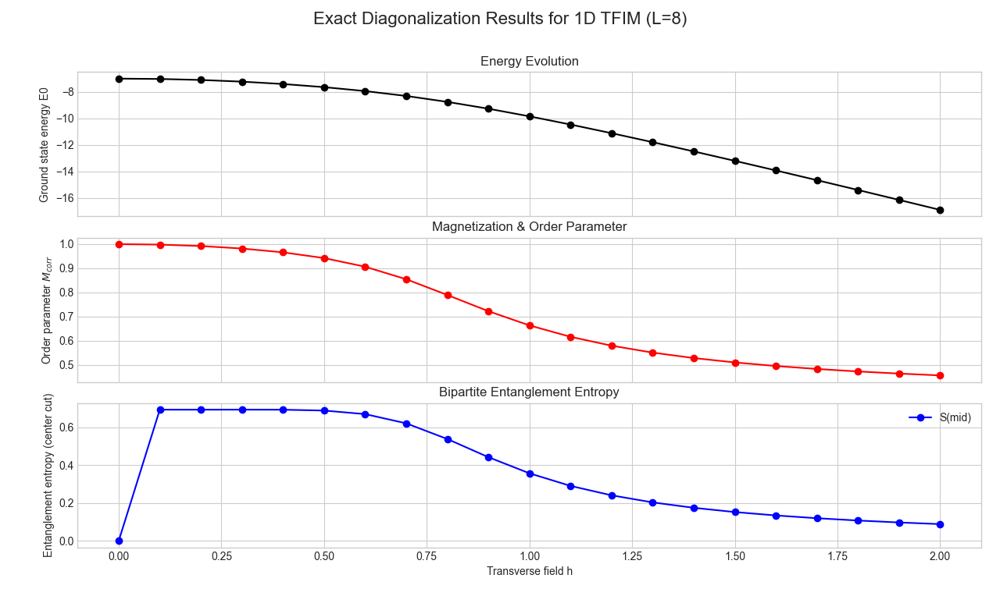

# Exact Diagonalization of the 1D Transverse Field Ising Model

This script computes the **ground state properties of the one–dimensional Transverse Field Ising Model (TFIM)** using **Exact Diagonalization (ED)**.

The method constructs the **full Hamiltonian matrix** of the quantum spin system and diagonalizes it to obtain the **exact ground state wavefunction and energy**.

From the ground state, the script computes several physical observables:

- Ground state energy  
- Average magnetization  
- Correlation-based order parameter  
- Nearest-neighbour correlations  
- Entanglement entropy  
- Entanglement spectrum  

The results are then visualized as functions of the transverse field strength.

---

# What is Exact Diagonalization?

**Exact diagonalization (ED)** is one of the most direct and reliable numerical methods used in quantum many-body physics.

The idea is simple:

1. Construct the **Hamiltonian matrix** of the system.
2. Diagonalize it numerically.
3. Extract the **lowest eigenvalue and eigenvector**, which correspond to the **ground state energy and wavefunction**.

Mathematically, we solve

$$
H |\psi_n\rangle = E_n |\psi_n\rangle
$$

where

- $H$ is the Hamiltonian matrix  
- $E_n$ are the eigenvalues  
- $|\psi_n\rangle$ are the eigenstates  

The **lowest eigenvalue $E_0$** gives the **ground state energy**.

Because this method directly diagonalizes the Hamiltonian, the results are **numerically exact (up to machine precision)**.

However, the Hilbert space grows exponentially with system size:

$$
\text{dimension} = 2^L
$$

For example:

| System size | Hilbert space size |
|-------------|-------------------|
| $L = 8$ | $256$ |
| $L = 10$ | $1024$ |
| $L = 12$ | $4096$ |

This exponential growth limits ED to **small system sizes**.

---

# Why Exact Diagonalization is Useful Here

The **Transverse Field Ising Model** is a standard model used to study **quantum phase transitions**.

The Hamiltonian is

$$
H = -J \sum_i Z_i Z_{i+1} - h \sum_i X_i
$$

where

- $J$ is the interaction strength between neighbouring spins  
- $h$ is the transverse magnetic field  
- $Z_i Z_{i+1}$ represents spin–spin interaction  
- $X_i$ represents the transverse field acting on each spin  

For small values of $h$, the spins align and the system is **ferromagnetic**.

For large values of $h$, the transverse field dominates and the system becomes **paramagnetic**.

Exact diagonalization allows us to compute the **true ground state** of this system for each value of $h$, which provides a reference solution for comparison with approximate methods such as

- Variational Quantum Eigensolvers (VQE)
- Tensor network methods
- Quantum Monte Carlo

---

# Script Structure

## 1. System Parameters

```python
L = 8
J = 1.0
h_values = np.linspace(0.0, 2.0, 21)
```

These parameters define the physical system.

- $L$ is the number of spins in the chain  
- $J$ is the Ising interaction strength  
- $h$ is the transverse magnetic field  

The Hilbert space dimension is

$$
2^L = 256
$$

---

# 2. Pauli Operators

The code defines the Pauli matrices

```python
X = [[0,1],[1,0]]
Z = [[1,0],[0,-1]]
```

These operators represent spin operators acting on each qubit.

To build many-body operators, the script uses **Kronecker products**.

A helper function

```python
def kron_list(mats):
```

combines multiple matrices using tensor products.

---

# 3. Building the Hamiltonian

The Hamiltonian is constructed as

$$
H = -J \sum_{i=1}^{L-1} Z_i Z_{i+1} - h \sum_{i=1}^{L} X_i
$$

The script first **precomputes the operators $Z_i$ and $X_i$** acting on each site.

Then the Hamiltonian is assembled by summing

- nearest neighbour interaction terms  
- transverse field terms  

This produces a **$256 \times 256$ dense matrix**.

---

# 4. Diagonalizing the Hamiltonian

The Hamiltonian is diagonalized using

```python
scipy.linalg.eigh
```

which returns

- all eigenvalues  
- all eigenvectors  

The **lowest eigenvalue** corresponds to the **ground state energy**

```python
E0 = evals[0]
psi = evecs[:,0]
```

---

# 5. Observables

Once the ground state wavefunction is obtained, the script computes several physical quantities.

---

## Average Magnetization

$$
|Z| = \frac{1}{L} \sum_i |\langle Z_i \rangle|
$$

This measures how strongly spins align with the $Z$ axis.

---

## Correlation-Based Order Parameter

$$
M_{corr} =
\sqrt{
\frac{1}{L^2}
\sum_{i,j}
\langle Z_i Z_j \rangle
}
$$

This measures long-range spin correlations.

Large values indicate an **ordered phase**.

---

## Nearest-Neighbour Correlation

$$
\langle Z_i Z_{i+1} \rangle
$$

This provides a measure of local spin alignment.

---

## Entanglement Entropy

The chain is bipartitioned at the center.

The reduced density matrix is constructed and the entropy is calculated as

$$
S = -\sum_i \lambda_i \log(\lambda_i)
$$

where $\lambda_i$ are the eigenvalues of the reduced density matrix.

Large entropy indicates **strong quantum correlations**.

---

## Entanglement Spectrum

The eigenvalues of the reduced density matrix are converted into **entanglement energies**

$$
\epsilon_i = -\log(\lambda_i)
$$

These quantities provide deeper information about the structure of the quantum state.

---

# Results

The table below shows the results obtained from exact diagonalization.

| $h$ | Energy $E_0$ | Avg $\|Z\|$ | $M_{corr}$ | $S(\mathrm{mid})$ | $\langle ZZ \rangle_{nn}$ |
|---|---|---|---|---|---|
| 0.0 | -7.000000 | 1.0000 | 1.0000 | 0.0000 | 1.0000 |
| 0.1 | -7.025019 | 0.0000 | 0.9981 | 0.6932 | 0.9964 |
| 0.2 | -7.100306 | 0.0000 | 0.9922 | 0.6932 | 0.9856 |
| 0.3 | -7.226620 | 0.0000 | 0.9818 | 0.6934 | 0.9671 |
| 0.4 | -7.405591 | 0.0000 | 0.9660 | 0.6930 | 0.9401 |
| 0.5 | -7.640593 | 0.0000 | 0.9423 | 0.6886 | 0.9024 |
| 0.6 | -7.937821 | 0.0000 | 0.9065 | 0.6698 | 0.8502 |
| 0.7 | -8.305611 | 0.0000 | 0.8547 | 0.6211 | 0.7810 |
| 0.8 | -8.749171 | 0.0000 | 0.7896 | 0.5384 | 0.7003 |
| 0.9 | -9.264158 | 0.0000 | 0.7225 | 0.4425 | 0.6204 |
| 1.0 | -9.837951 | 0.0000 | 0.6636 | 0.3572 | 0.5507 |
| 1.1 | -10.456458 | 0.0000 | 0.6164 | 0.2906 | 0.4932 |
| 1.2 | -11.108215 | 0.0000 | 0.5796 | 0.2408 | 0.4462 |
| 1.3 | -11.784918 | 0.0000 | 0.5510 | 0.2035 | 0.4076 |
| 1.4 | -12.480707 | 0.0000 | 0.5284 | 0.1749 | 0.3753 |
| 1.5 | -13.191405 | 0.0000 | 0.5103 | 0.1525 | 0.3479 |
| 1.6 | -13.913976 | 0.0000 | 0.4955 | 0.1345 | 0.3244 |
| 1.7 | -14.646164 | 0.0000 | 0.4832 | 0.1199 | 0.3039 |
| 1.8 | -15.386257 | 0.0000 | 0.4729 | 0.1077 | 0.2860 |
| 1.9 | -16.132929 | 0.0000 | 0.4641 | 0.0975 | 0.2701 |
| 2.0 | -16.885141 | 0.0000 | 0.4566 | 0.0888 | 0.2559 |

---

# Plot of Results

Insert the generated plot below.

```

```

Example (after adding your figure):




The plot typically shows

1. Ground state energy vs transverse field  
2. Order parameter vs transverse field  
3. Entanglement entropy vs transverse field  

The peak in entanglement entropy near the critical region signals the **quantum phase transition**.

---

# Key Observations

- Ground state energy decreases as the transverse field increases.
- The correlation order parameter decreases as the system becomes disordered.
- Entanglement entropy peaks near the critical region.
- The system transitions from a **ferromagnetic phase** to a **paramagnetic phase**.

Because exact diagonalization computes the **true ground state**, these results serve as a **benchmark for approximate quantum algorithms** such as VQE.

---

# Dependencies

Install required packages:

```
pip install numpy scipy matplotlib
```

---

# Running the Script

Run the program using

```
python exact_diagonalization_TFIM.py
```

The script will print the results and display the plots.

---
